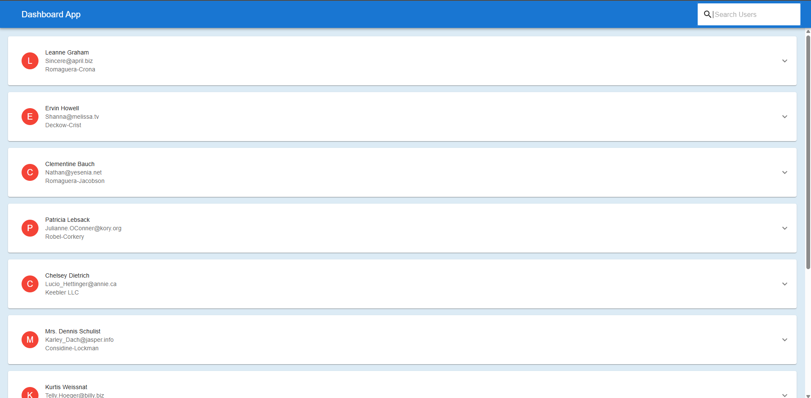

# Home Page

# Information Regarding Dashboard app Project:

1. You will see list of user, clicking on any user will expand the accordion.

2. Inside the accordion you will the the posts of user and the todos and completion status.

3. You can search the user by their name.

## Available Scripts

In the project directory, you can run:

### `yarn` or `yarn install`

then run

### `yarn start`

Runs the app in the development mode.\
Open [http://localhost:3000](http://localhost:3000) to view it in the browser.
